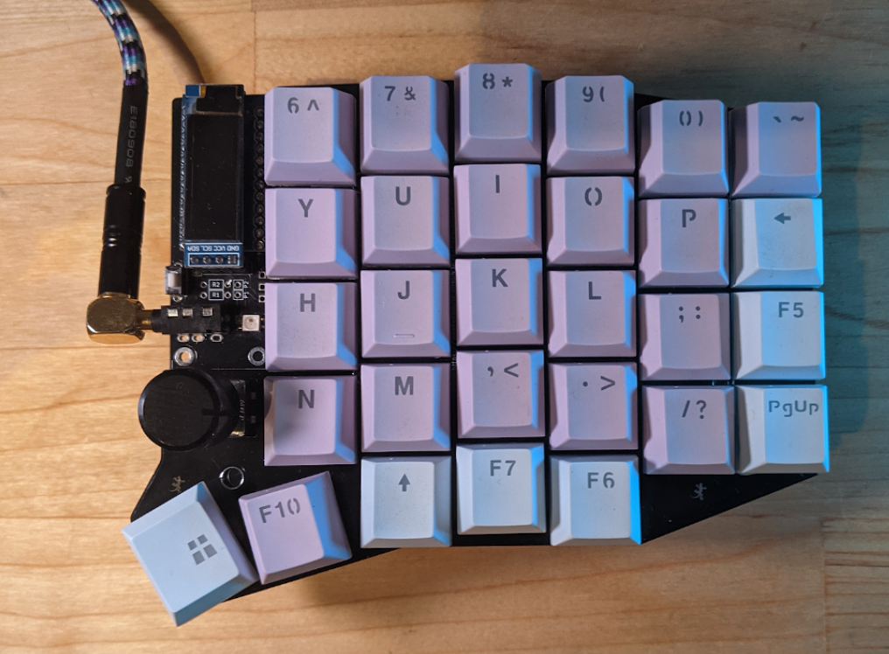

# Armado del teclado sofleRGB

El teclado Sofle RGB es una copia del teclado Sofle v2 con la adición de hasta 36 leds RGB por lado. Sí solo está buscando este diseño y está utilizando los switch cherry, entonces le recomiendo este modelo.

También volví a la clavija del pro-micro original y rehice por completo el diseño de pistas.

La ubicación de la pantalla OLED y los orificios de la carcasa del está no han cambiado.

**Esta guía de compilación**

En su mayor parte, esta guía es la misma que la Sofle. He robado descaradamente la guía de compilación de Josef y la he abreviado en gran medida para cubrir la mayoría de las diferencias. Si necesita más detalles, consulte la [guía de compilación](https://josefadamcik.github.io/SofleKeyboard/build_guide.html) principal.

--- 

### Lista de materiales

Se necesita lo siguiente para construir el teclado.

- **2 PCB** , ** NOTA: ** Hay un problema con las placas v2.0. Consulte la sección Solución de problemas en la parte inferior de la página para obtener más detalles si tuvo la mala suerte de hacer una placa con estos archivos.

- **2 placas superiores** , **2 placas inferiores** para una estructura tipo sándwich.

- **2 Pro Micro** placa o clon. Con 2x12 pines y microcontrolador ATmega32U4. Solo asegúrese de **no** comprar algo como Arduino Micro (un pinout diferente) o Arduino Mini (un microcontrolador diferente). También puede usar Elite-C, que básicamente Pro Micro con USB-C.

- **Cabezal de 4x12 pines (y opcionalmente zócalo)** para Pro Micros. Hay varias formas de montar Pro Micros en la placa. O los encabezados de PIN macho que probablemente obtuvo con la placa del proveedor podrían usarse para soldarla directamente a la placa. Las guías de construcción para Helix, Corne y Lily58 sugieren [esos cabezales de pasador de resorte](https://yushakobo.jp/shop/a01mc-00/) que son muy compactos y le brindan una conexión no permanente (puede quitar o reemplazar Pro Micros). Otro posible enfoque [se describe en splitkb.com](https://docs.splitkb.com/hc/en-us/articles/360011263059)
- **58 hotswap bases** . La PCB admite enchufes para conmutadores MX tradicionales. Están disponibles en Aliexpress, KBDFans y otros.

- **58 switches** de teclado de su preferencia, MX. Solo asegúrese de tener enchufes correspondientes para ellos.

- **58 keycaps** . Puede usar cualquiera de los dos en 1u de tamaño, pero se ve mejor con dos 1.5u para las teclas del pulgar.

- **58 diodos 1N4148W** . Son diodos de montaje en superficie en paquete SOD123.

- **2 conectores TRRS** . El mismo tipo que se utiliza para Corne, Lily58, etc. Técnicamente, incluso TRS debería funcionar [^ 1] si se ciñe a la comunicación serie (predeterminada).

- Agujero pasante de **2 botones táctiles** , 2 pines. Técnicamente opcional: puede utilizar pinzas metálicas siempre que necesite reiniciar el microcontrolador. También hay una tecla de reinicio en el diseño predeterminado, por lo que mientras tenga el firmware actualizado y funcionando, no debería necesitar el botón de reinicio en la placa.

- **1 cable TRRS** . TRS debería funcionar si te quedas con Serial.

- **10 (+4) espaciadores M2** . 10 mantendrán la parte inferior y la parte superior juntas. Su altura depende de los interruptores que utilice. Una guía de compilación que Lily58 Pro sugiere 7mm para MX. No pude conseguirlo 7mm, pero 6mm funcionó bien para mí con los interruptores MX. Usé los de latón, pero también puedes comprar mejores de aluminio anodizado.

- **20 (+8) tornillos M2** . 20 mantendrán las tablas juntas (mediante espaciadores). Usé algunos que tenía en mi stock, así que no les voy a decir la longitud exacta. Pero deben ser lo suficientemente largos para fijar una 1.6mm PCB gruesa al espaciador y lo suficientemente cortos para que dos de ellos puedan caber en un espaciador (podría ser más complicado con espaciadores de 4 mm para interruptores Choc)

- **8-10 pies de goma adhesiva** . Son realmente importantes, créeme.

- **Cable micro USB** para conectar el teclado a una computadora.

---

### Opcional

- **OLED / s**
- **2 módulo de pantalla OLED ssd1306 128x32** . Muy común en todas partes.
- **2 conectores de 4 pines (y opcionalmente zócalo base)** para OLED. He usado los enchufes de clavija hembra de 1x4 más comunes que son bastante altos pero también se ajustan a la altura de ProMicro con los enchufes que he usado. Desafortunadamente, los encabezados de los pines en mis módulos OLED (nuevamente esos encabezados macho cuadrados muy comunes que obtendría con los módulos) están sueltos en los enchufes. Funciona pero es complicado. Tendré que encontrar una mejor solución.
- **2 Cubierta OLED** Está disponible en [el repositorio (oled_cover.svg)](https://github.com/josefadamcik/SofleKeyboard/tree/master/Sofle_RGB/Case/)
- **Codificadores rotativos**
- **2 codificadores rotativos EC11** , si no está seguro, tome EC11E. Algunas otras variantes (EC11K) pueden tener algunas clavijas de plástico adicionales y requerir orificios de montaje para ellas (que no están incluidas en la PCB).
- **Una perilla a juego** para cada codificador.
- **LED**
- **Mini leds RGB SK6812 (tamaño de 3,5 mm x 3,5 mm)** asegúrese de obtener el estilo con almohadillas de forma irregular que estén al ras del LED, y asegúrese de saber cuál es el pinout para su variante. Hay al menos 2 pines comunes, afortunadamente solo rotados 180 grados, pero para usted, la marca del pin 1 puede estar en el pin 3.
- **1x indicador de capa orientado hacia adelante**
- **6 luces orientadas hacia atrás**
- **29x luces de tecla**

--- 

### Herramientas y materiales

- soldador
- Estaño
- buenas pinzas
- cinta adhesiva
- alcohol isopropílico para limpieza
- destornillador

--- 

### Pasos

##### Preparar

Asegúrese de saber en qué lado está trabajando y no haga dos lados izquierdos por error.

#### Los LED

Averigüe que leds desea tener, me he esforzado por proporcionar mucha flexibilidad y todas las configuraciones de leds que están disponibles utilizando los terminales disponibles. Si desea experimentar, use terminales y puentes de 2,54 mm. Si sabe lo que quiere, use un puente de soldadura para habilitar los leds requeridos.  
El terminal LED tradicional está disponible y se puede usar solo o, teóricamente, retroalimentar a uno de los otros terminales si así se desea.

Asegúrese de saber en qué dirección están sus leds, las diferentes marcas tienen diferentes posiciones de pin 1. Afortunadamente, parece que el patrón de la almohadilla debajo es consistente, así que úselo. Recomiendo hacer un LED y probarlo antes de continuar. Desafortunadamente, esto sugiere soldar el micro primero, a pesar de que hace que la parte posterior sea más difícil de soldar. Una buena alternativa sería utilizar un teclado existente con leds para inyectar la señal y la energía a través del encabezado del LED.

### Pinouts de LED

La imagen de arriba es de la guía crkbd que muestra el pin 4 en la mesa (la mesa se ve desde la parte superior del LED).

**El sofle RGB utiliza la siguiente tabla, con la marca de serigrafía en el pin 1 (Dout)**
 | pin | neto | neto | pin | | - | - | - | - | | 1 | Dout | Vcc | 4 | | 2 | Gnd | Din | 3 |

El uso del patrón base es el único patrón consistente entre al menos dos modelos diferentes con diferentes definiciones y marcas del pin 1.

Los siguientes dos extractos de la hoja de datos muestran dos versiones del LED con diferentes patrones de numeración. Pero muestra el mismo diseño y etiquetas de red en la parte inferior.

### Soldadura

Los LED de montaje en superficie son más fáciles de soldar, y solo hay 1 + 6 de ellos en cada lado, por lo que son un buen lugar para comenzar si no está acostumbrado a soldarlos. Utilice una temperatura bastante baja (240 ° C) y mucho flux. Coloque el led en posición, caliente una de las almohadillas en la placa durante varios segundos antes de mover la plancha para tocar el pin del led, luego agregue soldadura. Mover la plancha hacia adelante y hacia atrás desde el pin puede ayudar a que la soldadura fluya debajo del LED,

He agregado un solo LED a la superficie superior para que actúe como un indicador de capa, esto se habilita puenteando 2-3 en J6 (derivación del indicador).

Para habilitar la iluminación de caída, acorte los pines 2-3 de J4 (selección de luz), para habilitar solo por tecla la iluminación de los pines cortos 1-2 de J4. Si desea utilizar la iluminación por tecla, también debe acortar los pines 1-2 de 5.

| **Indicador** **Capa** | **Iluminación de gota** | **Por switch** | **j6 (derivación de Ind)** | **j4 (selección de luz)** | **j5 (luz de fondo)** |
| ------------------------- | ----------------------- | -------------- | -------------------------- | ------------------------- | --------------------- |
| norte                     | norte                   | norte          |                            |                           |                       |
| norte                     | norte                   | **Y**          | 1-2                        | 1-2                       |                       |
| norte                     | **Y**                   | norte          | 1-2                        | 2-3                       |                       |
| norte                     | **Y**                   | **Y**          | 1-2                        | 2-3                       | 1-2                   |
| **Y**                     | norte                   | norte          | 2-3                        |                           |                       |
| **Y**                     | norte                   | **Y**          | 2-3                        | 1-2                       |                       |
| **Y**                     | **Y**                   | norte          | 2-3                        | 2-3                       |                       |
| **Y**                     | **Y**                   | **Y**          | 2-3                        | 2-3                       | 1-2                   |

La iluminación por tecla es dolorosa y lenta. Para estos, definitivamente es mejor hacerlos en orden y probarlos regularmente. Use la temperatura más baja que pueda, coloque la placa plana sobre una mesa y coloque un LED. Cree un puente de soldadura desde el LED hasta la placa, sin pasar demasiado tiempo con la plancha en el LED (unos segundos) de lo contrario, se quemará.

Si la parte de la cadena deja de funcionar, resuelva la última que funciona y la primera en fallar, luego, si es necesario, reemplácelas.

### Diseños de LED

** Indicador + iluminación de gota **

** Indicador + iluminación por tecla **

** Indicador + iluminación de gota + iluminación por tecla **

### Componentes en la parte trasera

- Empiece por los diodos. Asegúrese de tener la orientación correcta, todos están orientados hacia el mismo lado. El extremo con la línea delgada es cátodo (-) y debe ir en la dirección del símbolo de "flecha" en la PCB.
- Los enchufes para interruptores pertenecen nuevamente en la parte posterior, el mismo lado que los diodos. Asegúrese de que estén al ras con la PCB y que coincidan con la orientación que se muestra en la serigrafía.

### Puente de las almohadillas oled

Esto se hace en la parte superior, se deben completar los 4 puentes de soldadura. Esto es más fácil antes de que se suelden los micro encabezados pro

### Componentes en la parte frontal

- Los enchufes de botón y TRRS pertenecen a la parte superior. Use un trozo de cinta para fijarlos y aplique soldadura desde el lado inferior.

### Pro Micro y pantallas

- El pro micro debe instalarse con los componentes hacia la placa de circuito impreso y la parte posterior lisa hacia afuera. En teoría, creo que estos podrían instalarse en la parte inferior para un perfil más bajo.

Asegúrese de utilizar los terminales descritos en cualquier lado de la placa en el que monte el micro.

- Instale el oled de modo que se asiente sobre el micro

### Codificadores rotativos

- Agregue codificadores rotativos al final, son grandes y hacen que la soldadura sea más difícil

### Interruptores y placas de teclado

- Monte los separadores en la placa superior.
- Coloque los primeros interruptores en las esquinas de la placa.
- Encaje con cuidado los primeros interruptores en los enchufes. Tenga cuidado para no doblar sus contactos.
- Agrega el resto de los interruptores
- Monte la placa inferior.

### Últimos retoques

- Instale la perilla del codificador rotatorio.
- Opcionalmente, agregue cubiertas a los oled
- Coloque al menos 4 pies de goma adhesiva en las esquinas para que el teclado no se mueva cuando escriba.

### Advertencias y exenciones de responsabilidad

- No conecte ni desconecte el cable TRRS cuando el teclado esté encendido. Puede producirse un cortocircuito. Siempre desconecte primero el cable USB.
- Sea amable con los puertos micro USB en sus microcontroladores. Son fáciles de romper.
- Tenga en cuenta que este es un prototipo de teclado de bricolaje. No es un producto pulido.

### Firmware y programación

El teclado Sofle utiliza el [firmware QMK](https://github.com/qmk/qmk_firmware/) y el soporte para la placa es parte del repositorio principal de QMK. También hay un soporte básico en [QMK Configurator](https://config.qmk.fm/#/sofle/rev1/LAYOUT) pero no hay soporte de codificador o led.

El enfoque sugerido es crear el firmware usted mismo. Debe estar familiarizado con QMK y poder hacerlo funcionar en su entorno local. De lo contrario, [siga las instrucciones de la documentación](https://docs.qmk.fm/#/newbs) .

- Asegúrese de que su entorno QMK este configurado.
- Asegúrese de que las mitades no estén conectadas con el cable TRRS.
- Conecte la mitad a USB, actualice el firmware (¡siga siempre las instrucciones reales en la documentación de QMK! El comando podría verse así:) qmk flash -kb sofle/rev1 -km default. Utilice el botón de reinicio para reiniciar el teclado cuando se le solicite en la consola.
- Conecta la segunda mitad y hazlo parpadear de la misma forma que la anterior.
- Desconecte el cable USB. Conecte ambas mitades junto con el cable TRRS.
- Conecte el cable USB al lado **izquierdo** .
- ¡Disfrute de SofleKeyboard!

### Solución de problemas

Consulte la guía de construcción de Sofle.

**Placas V2.0** : hay un problema conocido en las placas V2.0 con el circuito LED: falta un rastro de una vía en la parte inferior de la placa (en la parte superior de la mitad izquierda)

Síntomas: solo funcionarán los primeros 4 LED de bajo brillo, esto ocurrirá en ambas mitades de la placa,

Remedio: Esto se puede corregir fácilmente agregando un cable entre la vía y el trazo inmediatamente arriba en la imagen. Es posible que deba raspar la máscara de soldadura en la vía, según el fabricante que haya utilizado. El otro extremo se puede adjuntar a la traza (después de quitar alguna máscara), o la huella / led en sí.

Esto se ha corregido en las placas v2.1 y, con suerte, no ha atrapado a mucha gente. Gracias a **jmo808** por encontrarlo y disculpas una vez más.

### Enlaces

- [Github con proyectos KiCad](https://github.com/josefadamcik/SofleKeyboard)
- [Diseño en el editor KeyboardLayout](http://www.keyboard-layout-editor.com/#/gists/76efb423a46cbbea75465cb468eef7ff)
- [Firmware de QMK](https://github.com/qmk/qmk_firmware/)
- [Configurador QMK](https://config.qmk.fm/#/sofle/rev1/LAYOUT)

### Firmware

SofleRGB usa el [firmware QMK](https://qmk.fm/) , puede usar cualquier mapa de teclas de Sofle.

**Diseño predeterminado**

El diseño predeterminado para SofleRGB está en el repositorio qmk y muestra algunas funciones de LED.

--- 

### Imágenes del teclado

--- 

### Notas al pie

[SofleKeyboard](https://github.com/josefadamcik/SofleKeyboard) es mantenido por [josefadamcik](https://github.com/josefadamcik) . Esta página fue generada por [GitHub Pages](https://pages.github.com/) . 

Esta guía es una adaptación de la hecha por [josefadamcik](https://github.com/josefadamcik/SofleKeyboard/blob/master/docs/build_guide_rgb.md) creador de este teclado.

