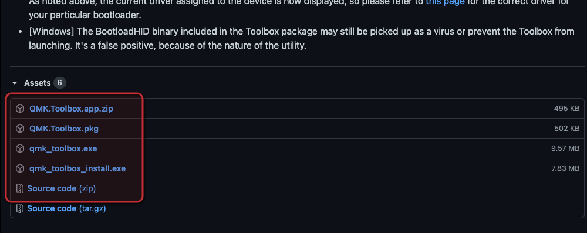
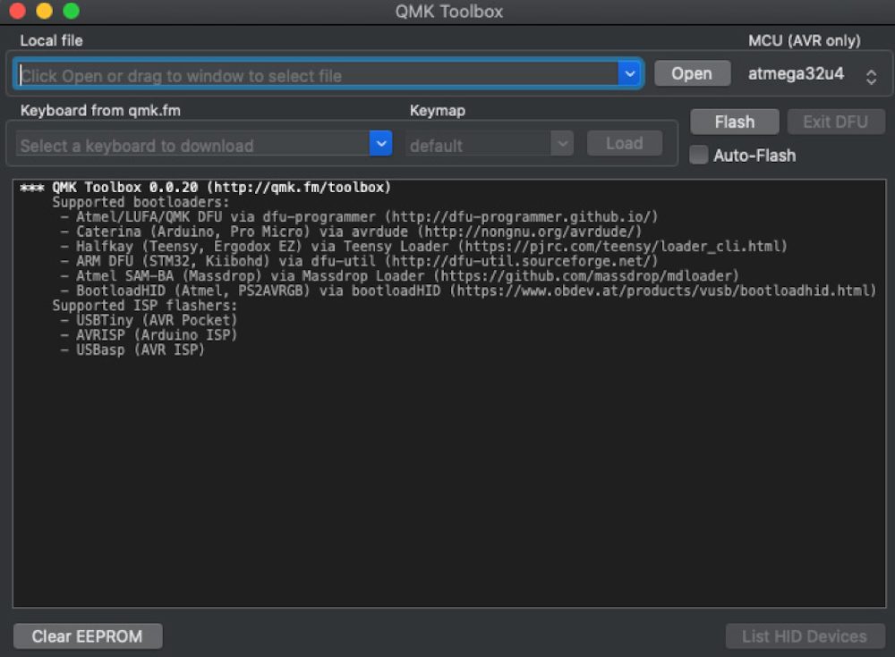
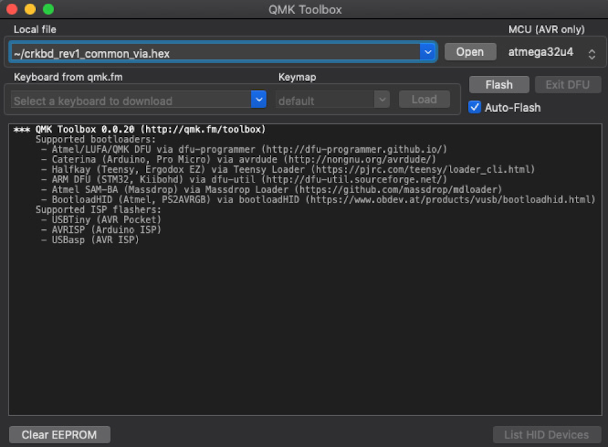
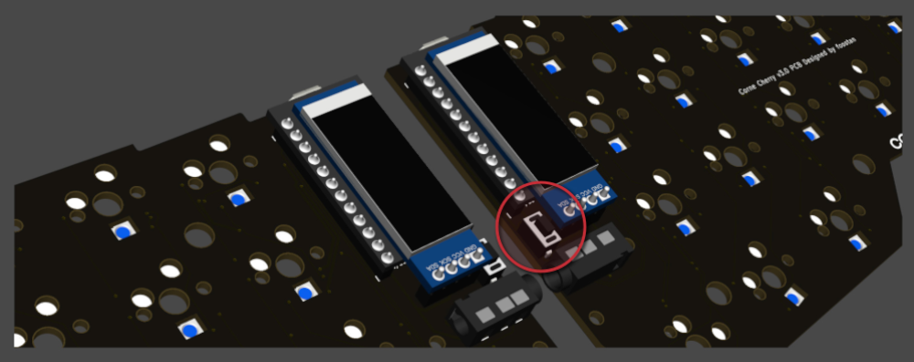
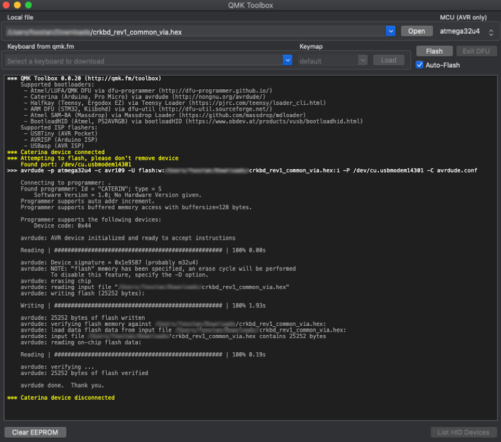

## Firmware

**Escritura de firmware**

Hay varias formas de escribir el firmware, pero [QMK Toolbox](https://qmk.fm/) es la forma más sencilla.

--- 

### Descarga QMK Toolbox
Descargue la última versión de QMK Toolbox desde la siguiente URL.  
https://github.com/qmk/qmk_toolbox/releases/

Instale QMK Toolbox desde el archivo descargado.  
Siga las instrucciones de cada sistema operativo para el método de instalación.

Cuando abra QMK Toolbox, se mostrará la siguiente ventana:

---

### Escritura de firmware

Seleccione el archivo descargado desde el botón "Open" de QMK Toolbox.  
También marque la casilla de verificación "Auto-Flash".

En este momento conecte el teclado a través de USB y presione el botón de "Reset", si es la primera vez que escribe el Firmware no es necesario.

Luego presione el botón "Flash" para comenzar con la escritura. Si el mensaje de escritura se muestra como se muestra a continuación, el proceso está completo.

Después de escribir el firmware en ProMicro en un lado, escriba en el otro lado con el mismo procedimiento.

Para personalizar el keymap recomendamos utilizar el configurador [online de qmk](https://config.qmk.fm/#/) o editar directamente el archivo keymap.c de alguna configuración pre existente.   
  
---  
  
  
### Archivo de configuración de ZoneKeyboards

**- Corne**

| Archivo de configuración compilado: | [**crkbd_zonekeyboards.hex**](https://zonekeyboards.cl/crkbd_rev1_zonekeyboards.hex) |
| ----------------------------------- | ------------------------------------------------------------------------------------ |
| Disposición de capas:               | [**corne.pdf**](https://zonekeyboards.cl/corne.pdf)                                  |

**- Lily58**

| Archivo de configuración compilado: | [**lily58_zonekeyboards.hex**](https://zonekeyboards.cl/lily58_rev1_zonekeyboards.hex "lily58_zonekeyboards.hex") |
| ----------------------------------- | ----------------------------------------------------------------------------------------------------------------- |
| Disposición de capas:               | [**lily58.pdf**](https://zonekeyboards.cl/lily58.pdf)                                                             |

**- Sofle**

| Archivo de configuración compilado: | [**sofle_zonekeyboards.hex**](https://zonekeyboards.cl/sofle_zonekeyboards.hex) |
| ----------------------------------- | ------------------------------------------------------------------------------- |
| Disposición de capas:               | [**sofle.pdf**](https://zonekeyboards.cl/sofle.pdf)                             |

**- Corne-Trackball-Pimoroni**

| Archivo de configuración compilado: | [crkbd_zonekeyboards_rtrackball.hex](https://zonekeyboards.cl/crkbd_zonekeyboards_rtrackball.hex) |
| ----------------------------------- | ------------------------------------------------------------------------------------------------- |
| Disposición de capas:               | [corne_rtrackball.pdf](https://zonekeyboards.cl/corne_rtrackball.pdf)                             |

**- Corne-Trackpad-Cirque**

| Archivo de configuración compilado: | [crkbd_rev1_zonekeyboards_cirque_touchpad.hex](https://zonekeyboards.cl/crkbd_rev1_zonekeyboards_cirque_touchpad.hex) |
| ----------------------------------- | --------------------------------------------------------------------------------------------------------------------- |
| Disposición de capas:               | [corne-cirque-trackpad.pdf](https://zonekeyboards.cl/Corne-Cirque-Trackpad.pdf)                                       |

Esta configuración es para OSX con idioma de teclado en Español.

**Nota**: No recomendamos el uso de VIA para configurar tu teclado, pues ha demostrado ser dificil de configurar correctamente y de provocar errores en el bootloader de los micro controladores.

Esta guía es una adaptación de la hecha por [foostan](https://github.com/foostan/crkbd/blob/master/doc/firmware_jp.md).  
  
Puedes obtener nuestros fuentes desde el siguiente enlace [qmk_firmware_0.18.17 ,](https://github.com/admfgonzalez/qmk_firmware_0.18.17) sientete libre de utilizarlos como base para tu personalización.

