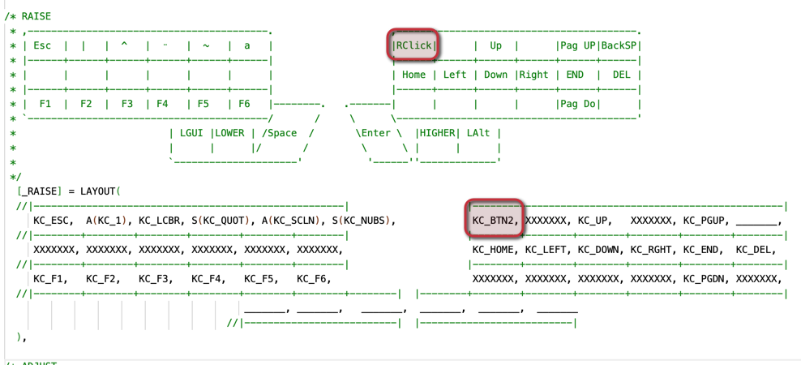
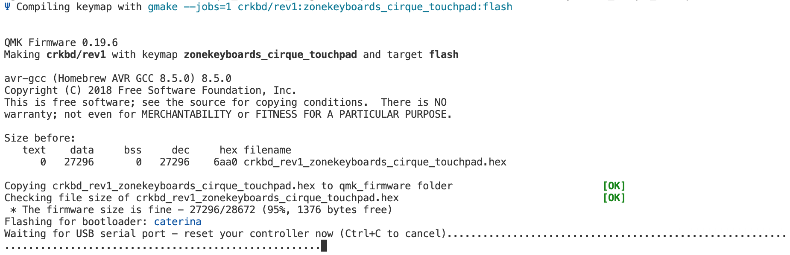
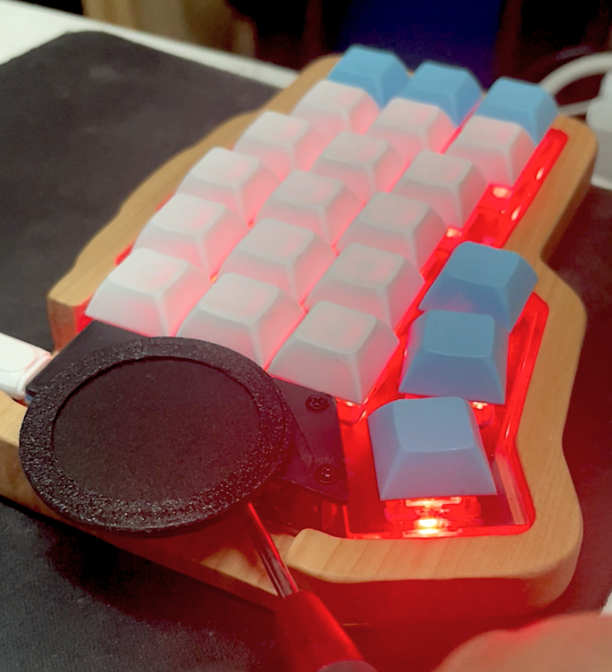

# Guía de instalación Cirque Trackpad

## Partes necesarias

|Pieza|Cantidad|Observaciones|
|---|---|---|
|Trackpad Cirque|1||
|Adaptador I2C|1||
|Cable FFC|1||
|Adaptador Teclado|1|Depende del tipo de Touchpad y teclado a instalar|

Para Instalar el Touchpad puedes seguir las instrucciones del siguiente video

https://www.youtube.com/watch?v=Vv0A8-beZto


Para configurar tu teclado, ocupando QMK, debes agregar las siguientes lineas de código en tus archivos de configuración (no es necesario incluir librerias externas):

En el archivo **rules.mk**, habilitamos el uso del Trackpad agregando las siguientes líneas al final del archivo

```
POINTING_DEVICE_ENABLE = yes
POINTING_DEVICE_DRIVER = cirque_pinnacle_i2c
```

En el archivo **config.h**, definimos sus opciones

Primero debemos definir el lado master en el que  agregamos el Trackpad, en este caso comentamos la declaración del lado izquierdo y agregamos la definición del lado derecho

```
// #define MASTER_LEFT
#define MASTER_RIGHT
```

Y definimos el uso del Trackpad, debemos agregar su diametro y podemos definir algunas opciones de uso como el click con un toque y el scroll con gesto (puedes ver todas las características disponibles en la documentación oficial)

```
#define CIRQUE_PINNACLE_DIAMETER_MM 35
#define CIRQUE_PINNACLE_TAP_ENABLE
#define POINTING_DEVICE_GESTURES_SCROLL_ENABLE
#define POINTING_DEVICE_ROTATION_270
```

Si seleccionaste trackpad curvo debes agregar primero la siguiente línea de código

```
#define CIRQUE_PINNACLE_CURVED_OVERLAY
```

**Opcional

En el archivo **keymap.c**

En nuestro caso definimos el click derecho en el keymap del teclado, esto lo logramos con el keycode 
**KC_BTN2** en la capa **RAISE**





Para que las teclas refrentes al mouse funcionen debes agregar esta opción en el archivo **rules.mk**

```
MOUSEKEY_ENABLE = yes
```

Finalmente guardamos los cambios y compilamos/flasheamos con el siguiente código (en nuestro caso el nombre del keymap es "**zonekeyboards_cirque_touchpad**"

```
qmk flash -kb crkbd/rev1 -km zonekeyboards_cirque_touchpad
```

Posterior a la compilación exitosa nuestra consola quedará a la espera de un microcontrolador que entre en modo **DFU**





En este momento conectamos nuestro teclado y apretamos el boton reset, en el corne esta debajo de la pantalla en el borde externo de la PCB.





Repetimos el flasheo con el otro lado del teclado, si es que hemos realizo más cambios, y listo a disfrutar de tu nuevo trackpad :).

Toda esta información la puedes encontrar en la [documentación oficial de QMK](https://docs.qmk.fm/#/), sobre la instalción del Trackpad puedes revisar [esta documentación.](https://github.com/qmk/qmk_firmware/blob/master/docs/feature_pointing_device.md)

Ejemplo de uso del Trackpad

https://www.youtube.com/watch?v=IkMbUaZYPMk


**Tambien te dejamos nuestra configuración Corne-Trackpad-Cirque**

| Archivo de configuración compilado: | [crkbd_rev1_zonekeyboards_cirque_touchpad.hex](https://zonekeyboards.cl/crkbd_rev1_zonekeyboards_cirque_touchpad.hex) |
| ----------------------------------- | --------------------------------------------------------------------------------------------------------------------- |
| Disposición de capas:               | [corne-cirque-trackpad.pdf](https://zonekeyboards.cl/Corne-Cirque-Trackpad.pdf)                                       |
| Archivos para compilar:             | [zonekeyboards_cirque_touchpad.zip](https://zonekeyboards.cl/zonekeyboards_cirque_touchpad.zip)                       |


